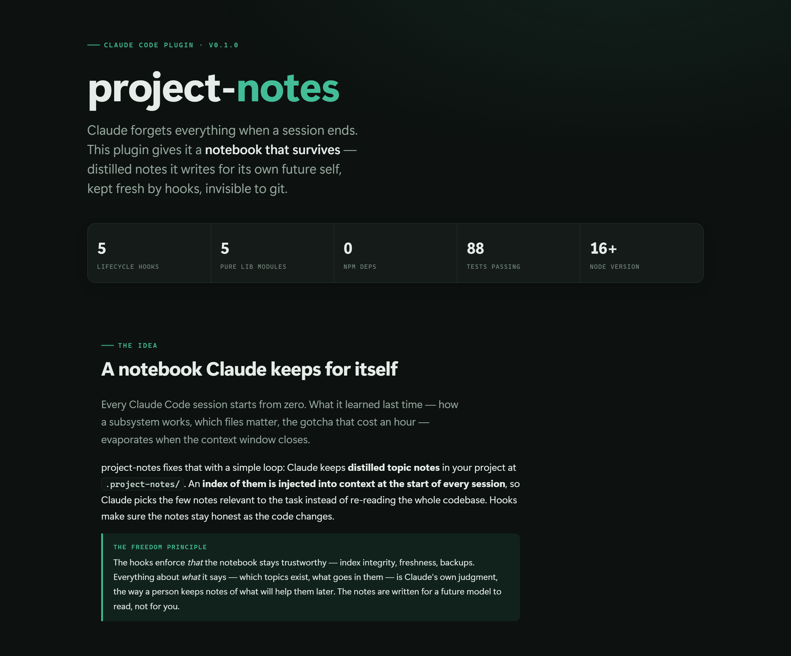

# project-notes

A Claude Code plugin that gives Claude a persistent, self-maintained notebook in
every project it works in — so each new session starts already knowing what
previous sessions learned, without you prompting it.

Claude Code sessions are amnesiac: knowledge earned in one session (how a
subsystem works, which files matter, why a decision was made) vanishes when the
context window closes. `project-notes` fixes that. Claude keeps distilled topic
notes in your project, an index of them is injected at the start of every
session, and hooks make sure the notes stay current as the code changes.

## Visual overview

A full walkthrough — the idea, the architecture, the five hooks, the note
format, and the design guarantees — is rendered as a standalone page:

[](https://git-aditya-star.github.io/project-notes/project-notes-explained.html)

**[▶ Open the full visual walkthrough](https://git-aditya-star.github.io/project-notes/project-notes-explained.html)**

> Served via GitHub Pages — enable it once under **Settings → Pages** (source:
> `main` branch, root folder) and the link goes live. Prefer no setup? The raw
> file [`project-notes-explained.html`](project-notes-explained.html) is
> self-contained — download it and open in any browser, or view it rendered via
> [htmlpreview](https://htmlpreview.github.io/?https://github.com/git-aditya-star/project-notes/blob/main/project-notes-explained.html).

## How it works

- **Notes live at `.project-notes/`** inside your project — so they travel with
  the folder. They're kept invisible to git via `.git/info/exclude` (never
  `.gitignore`), so teammates, diffs, and commits never see them. Non-git
  projects work identically.
- **One topic per file**, each with YAML frontmatter (`summary:`, `covers:`, and
  an auto-stamped `updated:`) plus distilled, pointer-rich understanding.
- **`INDEX.md` is generated** from the notes' frontmatter and injected into
  every session's context. Claude reads only the notes it needs.
- **Hooks enforce freshness.** Edit code that a topic covers, and the Stop hook
  won't let the turn end until you refresh that note. Explore heavily without
  writing anything down, and it gives a single, declinable nudge.
- **Backups.** Every note is snapshotted before it's overwritten (bounded ring
  under `.project-notes/.backups/`), so a bad rewrite can't destroy knowledge
  that git can't recover.
- **Content is Claude's judgment.** The plugin guarantees *that* notes stay
  honest; *what* they say — topics, organization, pruning — is up to Claude,
  like a person's own notebook.

## Install

```
/plugin marketplace add git-aditya-star/project-notes
/plugin install project-notes@project-notes
```

To develop or try it locally without installing:

```
claude --plugin-dir /path/to/project-notes
```

The plugin registers its own hooks; you never hand-edit settings files.

## Opting out of a project

Create a file named `.project-notes-off` at the project root. Every hook then
does nothing there — no directory, no injection, no tracking, no blocks. Delete
the file to re-enable.

## What it deliberately doesn't do

No embeddings/semantic search (a markdown index is enough at this scale), no
session journals or history archaeology, no cross-project/team knowledge, and no
human-facing note UI — the notes are written for a model to read.

## Contributing

- Hook scripts are **plain Node.js, zero dependencies, Node 16-compatible,
  cross-platform.** Keep them that way — the plugin must run for users with no
  install step.
- Tests run with `node tests/run-all.js` (uses the built-in `node:test`; no
  dependencies to install). Two seams: the hook-process boundary (real
  processes against temp dirs, no mocks) and direct unit tests of the pure
  functions in `lib/`.
- `lib/` holds pure logic (note format, matching, backups, state); `hooks/` are
  thin adapters over it; `skills/project-notes/SKILL.md` is the protocol Claude
  follows.
